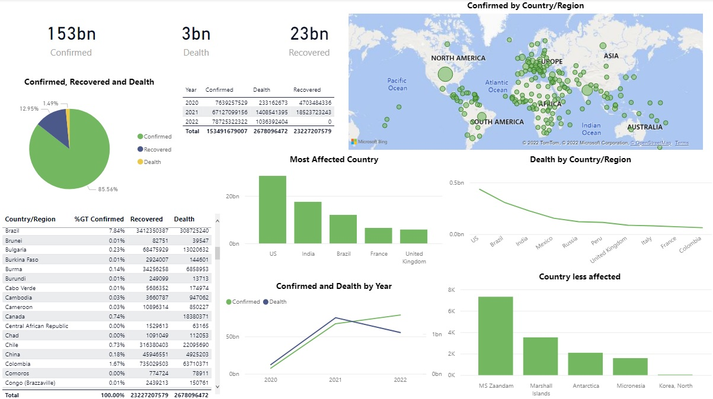

 [Covid-19 Data](https://latsan.github.io/Covid-19/)
 
 # Covid 19 case study
 
 ### The global coranavirus in 2019 case study
 ----
 
 ### Scenario
 
 * The coronavirus disease is a global disease that was discovered in 2019 and was given the name (COVID-19). It is a communicable respiratory disease caused by a new strain of coronavirus that causes illness in humans. 
Scientists research shows that the virus began in animals and one or more humans acquired infection from an animal, and those infected humans began transmitting the virus to other humans.
The disease spreads from person to person through infected air droplets that are projected during sneezing or coughing.  It can also be transmitted when humans have contact with hands or surfaces that contain the virus and touch their eyes, nose, or mouth with the contaminated hands. 
 
 *COVID-19 was first reported in China and later spread throughout the world in 2019.*
 
The Data was scrapped from COVID-19 Data Repository by the Center for Systems Science and Engineering (CSSE) at Johns Hopkins University. It is a public dataset
After scrapping, I transformed and clean the data by converting the data from a wide data to a long data and made the data ready for my analysis

## Findings
* A total of 153,491,679,007 (153 bn) cases was confirmed from 2019 till the time I scapped the data
* 2,678,096,472 (2.6 bn) death cases was confirmed which result to a percentage of 1.49% of the total confirmed rate
* A total number of 23,227,207,579 (23 bn) people has recovered which result to a percentage of 12.95% of the total confirmed rate
* United State of America was the most affected country with a number of 28,458,317,317 resulting to 18.54% of the world confirmed cases followed by India, Brazil, France, United Kingdom
* North Korea was the least affected country
* There is a strong correlation between confirmed cases to death cases hence, United State was recorded the country of highest death followed by Brazil and India

